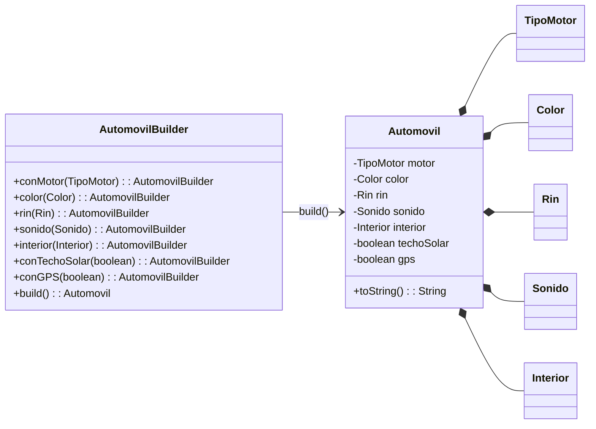

# 🚗 Configuración de Automóviles **Builder** (Java 17)

By: Rita Trindade y Brandon Merchan

> **Escenario (1)**  
> Una aplicación permite que los clientes personalicen un **automóvil** eligiendo motor, color, rines, sonido, interiores y extras (GPS, techo solar).  
> **Problema:** si usamos constructores tradicionales con muchos parámetros, terminaríamos con **constructores telescópicos** difíciles de leer y mantener.  
> **Requisito:** la simulación solo debe imprimir configuraciones de autos en consola usando `System.out.println`.

---

## 1. Identificar el tipo de patrón (Estructural, comportamiento, creacional)

##### 🧠 Patrón aplicado: **Builder**
El patrón **Builder** permite construir objetos complejos de forma **fluida y legible**, evitando los problemas de los constructores telescópicos.

- **Categoría:** **Creacional**
- **Beneficio clave:** separar la construcción paso a paso de la representación final, asegurando objetos **inmutables** y fáciles de configurar.

---

## 2. Seleccionar el patrón que considera que es
- **Razón principal:** El automóvil tiene **múltiples configuraciones opcionales** que harían crecer de manera caótica los constructores sobrecargados.  
- **Ventajas:**  
  - Legibilidad del código.  
  - Inmutabilidad del objeto final.  
  - Escalabilidad al agregar nuevas opciones sin romper compatibilidad.  

---

## 3. Diseñar el diagrama de clases de la solución



---

## 🎯 Objetivos de la solución
- Evitar el **constructor telescópico**.  
- Ofrecer una API **fluida y auto-documentada** para crear automóviles.  
- Permitir **defaults y validaciones** en un único lugar (`build()`).  
- Garantizar **inmutabilidad** del objeto `Automovil`.  

---

## 📁 Estructura del proyecto

```
src/main/java/com/patrones/autos/ej1/
├─ Main.java
├─ Automovil.java
├─ AutomovilBuilder.java
├─ TipoMotor.java
├─ Color.java
├─ Rin.java
├─ Interior.java
└─ Sonido.java
```

> El paquete es `com.patrones.autos.ej1`.

---

## ⚙️ Requisitos
- **Java 17**  
- **Maven 3.9+**

---

## 🚀 Ejecución

**Opción 1 (IDE: VS Code / IntelliJ)**  
Abrir `Main.java` y ejecutar con **Run Java**.

**Opción 2 (Consola, Maven)**  
```bash
mvn -q exec:java -Dexec.mainClass=com.patrones.autos.ej1.Main
```

**Salida esperada (simulada con `println`)**
```
=== Builder sin Director ===
Automovil{motor=GASOLINA, color=ROJO, rin=PERFORMANCE_19, sonido=PREMIUM, interior=CUERO, techoSolar=true, gps=true}
Automovil{motor=HIBRIDO, color=AZUL, rin=ALEACION_17, sonido=BASICO, interior=MIXTO, techoSolar=false, gps=true}
Automovil{motor=ELECTRICO, color=BLANCO, rin=ACERO_16, sonido=BASICO, interior=TELA, techoSolar=false, gps=false}
Automovil{motor=DIESEL, color=NEGRO, rin=ACERO_16, sonido=BOSE, interior=TELA, techoSolar=false, gps=false}
```

---

## 🧩 Cómo extender
- **Nuevos extras:** añadir métodos en `AutomovilBuilder` (ej. `conCamaraReversa(boolean)`).  
- **Validaciones adicionales:** validar combinaciones (ej. `ELECTRICO` no puede usar `DIESEL`).  
- **Presets (opcional):** crear una clase `DirectorAutomovil` con recetas (`deportivo()`, `familiar()`).  

---

## 🔍 Decisiones de diseño
- **Builder vs Telescópicos:** Builder mejora la legibilidad y evita errores por orden de parámetros.  
- **SOLID:**  
  - **SRP:** `Automovil` solo representa datos; `AutomovilBuilder` gestiona la construcción.  
  - **OCP:** se pueden agregar nuevas características extendiendo el builder sin modificar código existente.  
  - **LSP/DIP:** el cliente no depende de constructores largos, sino de una API fluida.  

---

## 📌 Notas
- El patrón Builder es ideal cuando el objeto tiene **muchas propiedades opcionales**.  
- En casos sencillos (pocos parámetros), un constructor único sería suficiente.  
