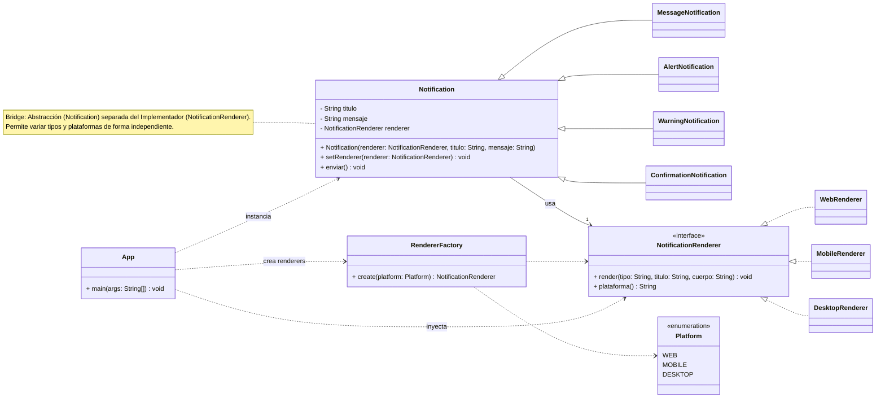

# Diagrama de clases — Patrón Bridge (Notificaciones)

> Generado para el escenario: tipos de notificación × plataformas con simulación via `println`.

```mermaid
classDiagram
direction LR

class Notification {
  - String titulo
  - String mensaje
  - NotificationRenderer renderer
  + Notification(renderer: NotificationRenderer, titulo: String, mensaje: String)
  + setRenderer(renderer: NotificationRenderer) void
  + enviar() void
}

class MessageNotification
class AlertNotification
class WarningNotification
class ConfirmationNotification

Notification <|-- MessageNotification
Notification <|-- AlertNotification
Notification <|-- WarningNotification
Notification <|-- ConfirmationNotification

class NotificationRenderer {
  <<interface>>
  + render(tipo: String, titulo: String, cuerpo: String) void
  + plataforma() String
}

Notification --> "1" NotificationRenderer : usa

class WebRenderer
class MobileRenderer
class DesktopRenderer

NotificationRenderer <|.. WebRenderer
NotificationRenderer <|.. MobileRenderer
NotificationRenderer <|.. DesktopRenderer

class Platform {
  <<enumeration>>
  WEB
  MOBILE
  DESKTOP
}

class RendererFactory {
  + create(platform: Platform) NotificationRenderer
}

RendererFactory ..> Platform
RendererFactory ..> NotificationRenderer
class App {
  + main(args: String[]) void
}

App ..> RendererFactory : crea renderers
App ..> Notification : instancia
App ..> NotificationRenderer : inyecta

note for Notification "Bridge: Abstracción (Notification) separada del Implementador (NotificationRenderer).
Permite variar tipos y plataformas de forma independiente."
```
