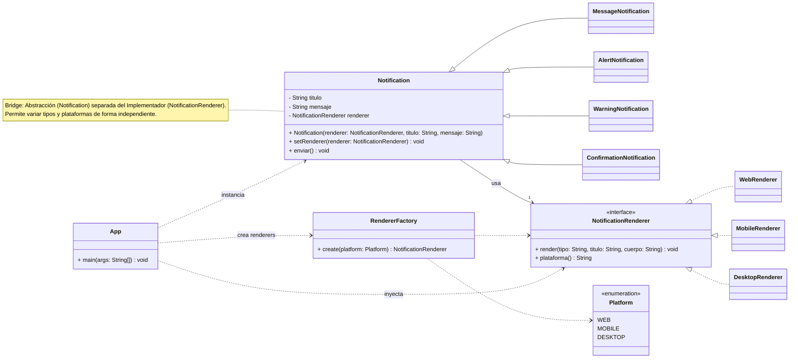

# Notificaciones Bridge (Java 17)

By: Rita Trindade y Brandon Merchan

> **Escenario (2)**  
> Una app debe **mostrar notificaciones** en distintas **plataformas** (Web, Móvil, Escritorio) y de **varios tipos** (Mensaje, Alerta, Advertencia, Confirmación). Cada combinación puede verse de forma diferente.  
> **Problema:** con herencia tradicional terminarías creando clases como `NotificacionMensajeWeb`, `NotificacionAlertaMovil`, etc. → **explosión combinatoria** difícil de mantener.  
> **Requisito:** no son notificaciones reales; **solo se simulan con `System.out.println`**.

---



---

## 🎯 Objetivos de la solución
- **Separar responsabilidades:** qué dice la notificación **(tipo)** vs. cómo se **renderiza** en cada plataforma.  
- **Escalable:** agregar **nuevos tipos** o **nuevas plataformas** sin tocar lo demás.  
- **Reducir clases:** pasar de `tipos × plataformas` a `tipos + plataformas`.  
- **Flexibilidad en tiempo de ejecución:** poder **cambiar la plataforma** de una notificación ya creada.

---

## 🧠 Patrón aplicado: Bridge
Separamos la **abstracción** (tipos de notificación) del **implementador** (plataforma/render).  
Así evitamos acoplar cada tipo con cada plataforma.


## 📁 Estructura del proyecto

```
src/main/java/com/patrones/notificaciones/
├─ Platform.java
├─ App.java
├─ core/
│  ├─ Notification.java
│  ├─ MessageNotification.java
│  ├─ AlertNotification.java
│  ├─ WarningNotification.java
│  └─ ConfirmationNotification.java
└─ render/
   ├─ NotificationRenderer.java
   ├─ WebRenderer.java
   ├─ MobileRenderer.java
   ├─ DesktopRenderer.java
   └─ RendererFactory.java
```

---

## ⚙️ Requisitos
- Java **17**
- Maven **3.9+**

---

## 🚀 Ejecución

**Opción 1 (rápida)**  
```bash
mvn -q exec:java
```

**Opción 2 (Jar ejecutable)**  
```bash
mvn -q clean package
java -jar target/notificaciones-bridge-1.0-SNAPSHOT.jar
```

**Salida esperada (simulada con `println`)**
```
WEB -> [MENSAJE] <h1>Nuevo mensaje</h1> <p>Tienes 1 mensaje sin leer.</p>
MÓVIL -> [ALERTA] (Toast/Push) ⚠ CPU Alta - USO POR ENCIMA DEL 90%
ESCRITORIO -> [ADVERTENCIA] {SystemTray} Espacio en disco (revísalo) :: Menos del 10% disponible
WEB -> [CONFIRMACIÓN] <h1>Eliminar archivo ✅</h1> <p>¿Seguro que deseas eliminarlo? (¿Confirmar?)</p>
MÓVIL -> [MENSAJE] (Toast/Push) Nuevo mensaje - Tienes 1 mensaje sin leer.
```

---

## 🧩 Cómo extender

### Nueva **plataforma**
1. Implementa `NotificationRenderer` (p. ej., `SmartWatchRenderer`).
2. Regístrala en `RendererFactory`.

```java
public class SmartWatchRenderer implements NotificationRenderer {
    public void render(String tipo, String titulo, String cuerpo) {
        System.out.println("WATCH -> [" + tipo + "] " + titulo + " • " + cuerpo);
    }
    public String plataforma() { return "WATCH"; }
}
```

> **No** tocas las clases de tipos (`Message/Alert/...`).  
> **Impacto:** +1 clase.

### Nuevo **tipo** de notificación
1. Extiende `Notification` (p. ej., `SuccessNotification`).
2. Define el formateo en `enviar()`.

```java
public class SuccessNotification extends Notification {
    public SuccessNotification(NotificationRenderer r, String titulo, String msg) { super(r, titulo, msg); }
    public void enviar() { renderer.render("ÉXITO", titulo + " ✅", mensaje); }
}
```

> **No** tocas las plataformas (`Web/Mobile/Desktop`).  
> **Impacto:** +1 clase.

---

## 🔍 Decisiones de diseño
- **Bridge vs. Strategy:** Strategy intercambia algoritmos; aquí desacoplamos **dos ejes** (tipo vs. plataforma) → **Bridge**.  
- **Bridge vs. Abstract Factory:** AF fabrica familias; aquí **conectamos** jerarquías independientes.  
- **SOLID:**  
  - **SRP:** tipos formatean contenido; renderers muestran según plataforma.  
  - **OCP:** añadir tipo o plataforma **no modifica** lo existente.  
  - **DIP:** `Notification` depende de la **abstracción** `NotificationRenderer`.

---

## 🧪 Pruebas (opcional)
- Captura `stdout` y verifica prefijos como `WEB -> [ALERTA]` al llamar `enviar()`.

---

## ✅ Buen diseño (Dieter Rams)
- **Claro:** cada clase tiene una única responsabilidad.  
- **Duradero:** ampliable sin romper.  
- **Cuidado por el detalle:** nombres, paquetes y factoría consistentes.

---

## 🛠️ Comandos útiles

```bash
# Compilar
mvn -q clean compile

# Ejecutar main
mvn -q exec:java

# Empaquetar Jar
mvn -q clean package
java -jar target/notificaciones-bridge-1.0-SNAPSHOT.jar
```

---

## 📌 Notas
- Todo es **simulado** con `System.out.println` (sin GUI ni push real).  
- Puedes **cambiar de plataforma en runtime** con `setRenderer(...)` en cualquier `Notification`.
