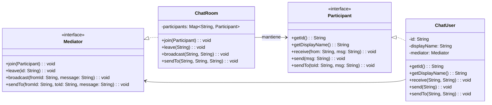
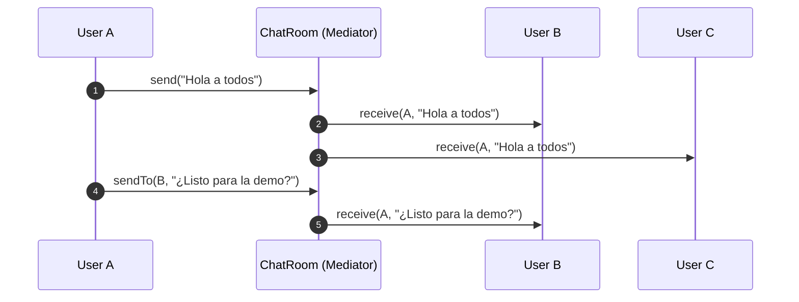

# Chat Grupal **Mediator** (Java 17)

By: Rita Trindade y Brandon Merchan

> **Escenario (3)**  
> Una app de **chat grupal** permite que varios usuarios se envíen mensajes dentro de una **sala**.  
> **Problema:** si cada usuario tuviera que conocer a todos los demás para comunicarse, habría **muchas dependencias** y sería difícil **escalar**.  
> **Requisito:** es una **simulación**: solo usamos `System.out.println` para mostrar resultados.

---

## 1. Identificar el tipo de patrón (Estructural, comportamiento, creacional)
##### 🧠 Patrón aplicado: **Mediator**
Centraliza la **comunicación** entre objetos (usuarios) en un **mediador** (sala).  
Los colegas (usuarios) **no** se comunican directamente entre sí, sino a través del mediador.

- **Categoría:** **Comportamiento (Behavioral)**
- **Beneficio clave:** Reduce el **acoplamiento N×N** a **N** (cada usuario depende solo del mediador).

---

## 2. Seleccionar el patrón que considera que es
- **Razón principal:** Queremos **desacoplar** a los usuarios y **centralizar** la lógica de envío, difusión y enrutamiento de mensajes.
- **Ventajas:**  
  - Agregar o eliminar usuarios **no** requiere tocar al resto.  
  - La lógica de entrega, moderación o filtros puede **vivir en el mediador** o en componentes auxiliares.

---

## 3. Diseñar el diagrama de clases de la solución



### Secuencia: broadcast y mensaje directo


---

## 🎯 Objetivos de la solución
- **Desacoplar** usuarios entre sí.
- **Centralizar** la lógica de comunicación (difusión, DM, entrada/salida de usuarios).
- **Escalabilidad:** nuevas reglas (moderación, filtros, métricas) se agregan sin tocar a cada usuario.
- **Mantenibilidad:** los cambios de infraestructura ocurren en un único punto (el mediador).

---

## 📁 Estructura del proyecto

```
src/main/java/com/patrones/chat/mediator/
├─ Mediator.java
├─ Participant.java
├─ ChatRoom.java
├─ ChatUser.java
└─ Main.java
```

> El paquete es `com.patrones.chat.mediator`.

---

## ⚙️ Requisitos
- **Java 17**
- **Maven 3.9+**

---

## 🚀 Ejecución

**Opción 1 (rápida)**  
```bash
mvn -q exec:java
```

**Opción 2 (Jar ejecutable)**  
```bash
mvn -q clean package
java -jar target/mediator-chat-1.0-SNAPSHOT.jar
```

**Salida esperada (simulada con `println`)**
```
[SYSTEM] Ana se unió a la sala.
[SYSTEM] Bruno se unió a la sala.
[SYSTEM] Caro se unió a la sala.
[Ana] Bruno: Hola equipo 👋
[Ana] Caro: Hola equipo 👋
[Bruno] Ana: ¡Lista la demo?
[SYSTEM] Caro salió de la sala.
[Bruno] Ana: Empezamos en 5 minutos.
```
*(Los prefijos pueden variar, pero la idea es: broadcast a todos menos el emisor; DM solo al destinatario).*

---

## 🧩 Cómo extender

### Múltiples salas (varios mediadores)
- Crear una clase `ChatHub` que administre varias instancias de `ChatRoom` (una por canal).
- Mover usuarios entre salas con `leave` + `join`.

### Moderación / Filtros
- Encadenar *policies* en `ChatRoom` antes de repartir mensajes (antispam, bad-words, rate limit).

### Persistencia / Historial
- Inyectar un `MessageStore` (archivo/DB) para guardar eventos sin mezclar responsabilidades.

### Notificaciones del sistema
- Publicar entradas/salidas como mensajes del emisor `"SYSTEM"` para trazabilidad.

---

## 🔍 Decisiones de diseño
- **Mediator vs Observer:** Observer difunde eventos; Mediator **coordina interacciones** entre colegas.
- **Mediator vs Pub-Sub:** Pub-Sub desacopla productores/consumidores; Mediator centraliza **reglas** de conversación.
- **SOLID:**  
  - **SRP:** `ChatUser` muestra/forma mensajes; `ChatRoom` enruta/coordina.  
  - **OCP:** añadir features (DM, filtros) sin modificar `ChatUser`.  
  - **DIP:** los usuarios dependen de la abstracción `Mediator`.

---

## 🧪 Pruebas (opcional)
- **Broadcast:** todos reciben excepto el emisor.  
- **Directo (DM):** solo el destinatario recibe.  
- **Leave:** tras salir, no debe recibir mensajes.  
- **Concurrencia:** `ConcurrentHashMap` para gestionar `join/leave` seguros.

---


## 🛠️ Comandos útiles

```bash
# Compilar
mvn -q clean compile

# Ejecutar main
mvn -q exec:java

# Empaquetar Jar
mvn -q clean package
java -jar target/mediator-chat-1.0-SNAPSHOT.jar
```

---

## 📌 Notas
- Todo es **simulado** con `System.out.println`.  
- Para entornos reales: separar **dominio** (eventos) de **infraestructura** (I/O, sockets, WebSocket, etc.).
